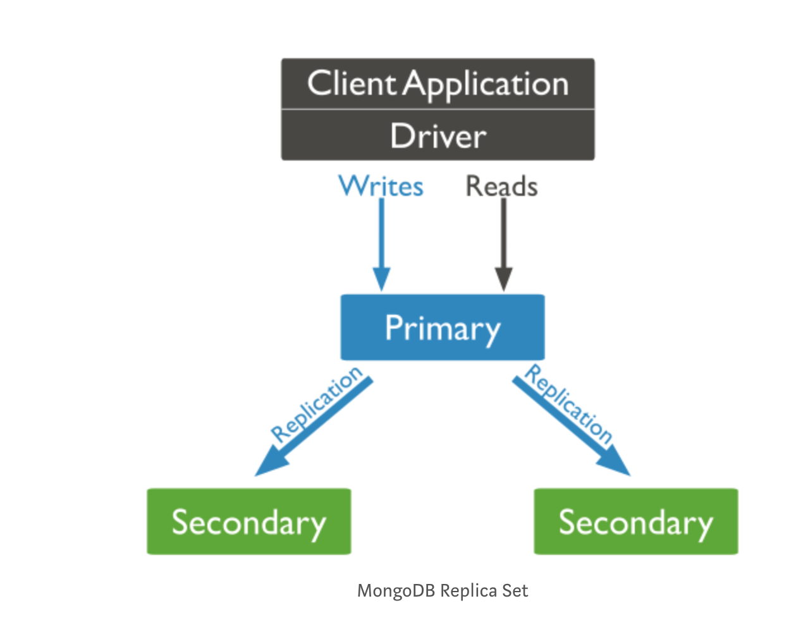
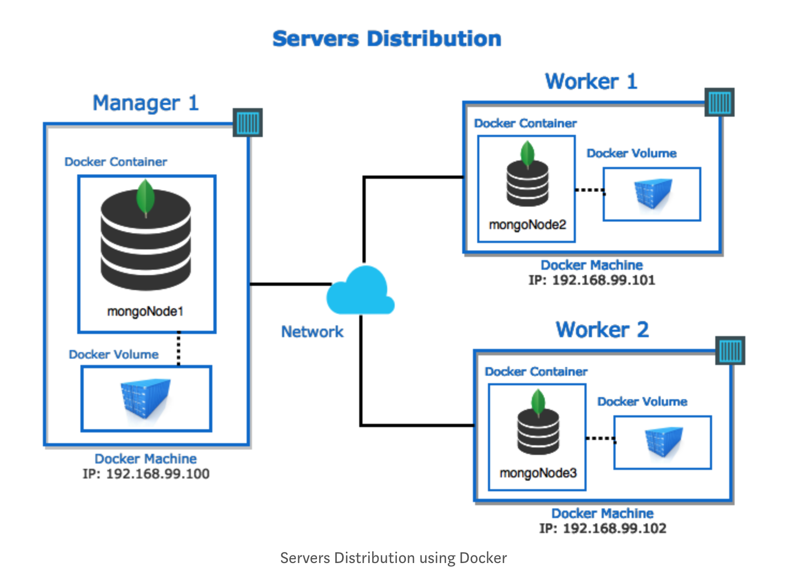

# mongdoDB replica set

本项目主要用来搭建docker集群中的mongodb replica set


## 为什么会出现这个项目

这个项目主要用来解决node集群中的数据库层次的问题，通过与docker深度结合，为后续booking-system的开发奠定基础

### 前提要求

- 确保系统已经安装mongodb(目前开发用的v4.0.1,有其他未知问题，欢迎ISSUE)
- 对docker(目前开发用的v18.09.2 build 6247962)以及集群有基本了解
- 对linux bash脚本有基本了解

```
mongod --version
```
```
docker-machine --version
```
## 注意
  
  在操作过程中，我们发现建立集群的条件必须是一台完整的物理机。如果在阿里云ECS或者类型的虚拟化机器上是无法再次创建虚拟机的，所以，请注意该项目需要在物理机上开展并且开启了虚拟化。


## 教程

 - 创建3个虚拟机，每个虚拟机里运行一个docker
 ```
  docker-machine create -d virtualbox manager1
 ```
  
 ```
  docker-machine create -d virtualbox workder1
 ```
  
 ```
  docker-machine create -d virtualbox worker2
 ```
 - 运行脚本
 ```
  bash < create-replica-set.sh
 ```
 - 连接主数据库
  这时候就可以用啦。
  
## 运行测试

```
docker exec -it mongoNode1 bash -c 'mongo -u $MONGO_USER_ADMIN -p $MONGO_PASS_ADMIN --authenticationDatabase "admin"'
```
```
use admin
```

  ***
  注意：这里是root权限，产品环境中尽可能不采用
```
db.grantRolesToUser( "cristian", [ "root" , { role: "root", db: "admin" } ] )
```
```
  use movies
```

```
  db.movies.insertMany([{
  id: '1',
  title: 'Assasins Creed',
  runtime: 115,
  format: 'IMAX',
  plot: 'Lorem ipsum dolor sit amet',
  releaseYear: 2017,
  releaseMonth: 1,
  releaseDay: 6
}, {
  id: '2',
  title: 'Aliados',
  runtime: 124,
  format: 'IMAX',
  plot: 'Lorem ipsum dolor sit amet',
  releaseYear: 2017,
  releaseMonth: 1,
  releaseDay: 13
}])
```


## 参考资料

* [mongodb replica set](https://docs.mongodb.com/manual/tutorial/deploy-replica-set/) -  mongdo replica set官方参考资料
* [docker-machine](https://maven.apache.org/) - docker-machine 官方参考资料


## 贡献与参与

为了更好的完成项目，我们欢迎各路豪杰参与进行[CONTRIBUTING.md](https://gist.github.com/PurpleBooth/b24679402957c63ec426)，所有参与进来并且贡献了卓有成效代码的成员都有项目的所有权，并且可以自由使用。(未经许可的成员擅自运用代码于商业活动中需要承担法律责任)

## 版本描述

 我们使用 [SemVer](http://semver.org/) 规范来进行版本管理. 

## 作者

* **LIANGJINGTANG** - *进行了项目的启动和构思工作* - [看看我?](https://showme.wiki)

非常高兴有更多的伙伴加入我们[点击这里查看我们的小伙伴们](https://github.com/your/project/contributors) 

## 协议

 项目基于GPL3.0 协议，点击这里[协议](LICENSE)获取更多的信息

## 鸣谢

* 项目灵感来源于@Cristian Ramirez，对此衷心感谢。

## FAQ
  1. Q:主数据库的IP是多少？ A: 一般情况，通过```docker-machine ls```查看第一个结点的ip就是，如果该结点停止过，那么主数据库自动迁移至后结点数据库。
    
## 最终完成目标

